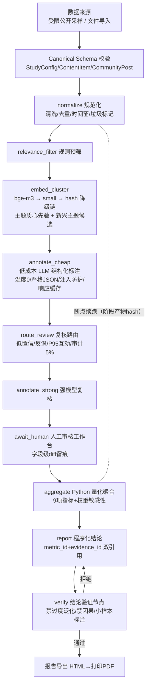
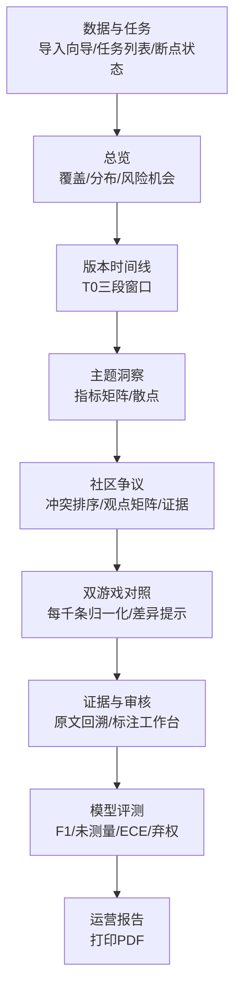

# 架构图（mermaid）

## 分析 Harness（受约束状态图）



## 数据流与产物

```mermaid
flowchart LR
    subgraph 采集（合规护栏）
        S1[搜索/元数据/评论接口<br/>限速≥2.5s] --> S2[journal 断点续采]
        S2 --> S3{风控码 -412/-352?}
        S3 -- 是 --> S4[硬停·不重试·转导入模式]
        S3 -- 否 --> S5[立即 HMAC 匿名化<br/>原始UID不落盘]
    end
    subgraph 分析任务（单机串行·文件锁）
        R1[manifest.json<br/>数据集hash/模型/提示词版本/代码SHA/成本] --> R2[normalized 阶段产物]
        R2 --> R3[annotations] --> R4[human_overrides.jsonl] --> R5[metrics.json]
        R5 --> R6[report.html + claims + verify]
    end
    subgraph 交付
        D1[本地模式 FastAPI+Next.js] --> D2[公开演示 静态导出<br/>匿名化+泄漏扫描断言]
    end
    S5 --> R1
    R6 --> D1 --> D2
```

## 前端页面（紧凑运营工作台）


